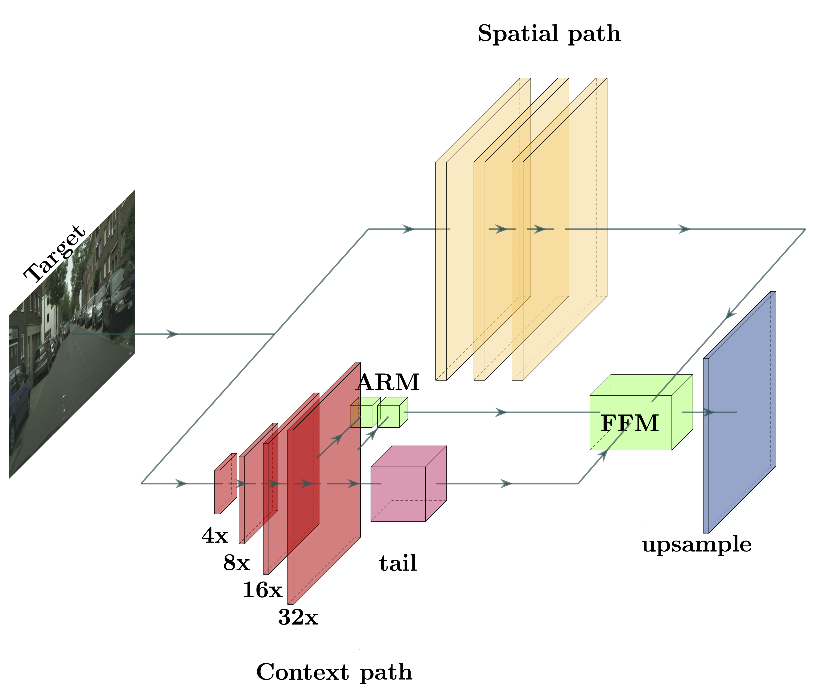

# Segmentation Network BiSeNet
Implementation of real-time semantic segmentation network BiSeNet for the Machine Learning and Deep Learning Course @ Politecnico di Torino

Backbone real-time segmentation network for [CoreSegNet](http://github.com/gio99c/CoreSegNet)

## Other repositories
### CoreSegNet
The repository of the context-aware domain adaptation network is available [here](http://www.github.com/gio99c/CoreSegNet)
### Domain Adaptation Network
The repository of the adversarial domain adaptation network is available [here](http://www.github.com/gio99c/AdaptSegNet)